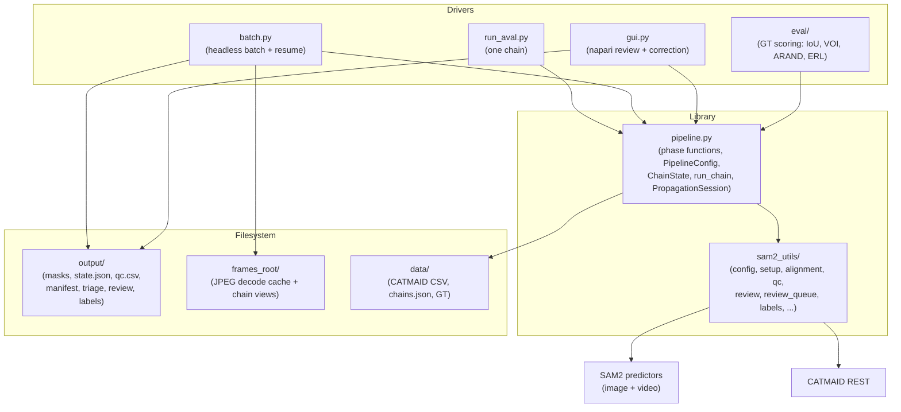
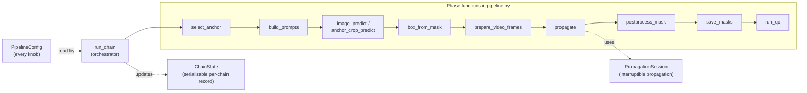

# Architecture

This is the north-star document. It explains what the project is, how it is shaped, and the
principles behind that shape. For the file-level "where do I change X" map, see
[../reference/code-map.md](../reference/code-map.md). For the reasoning behind specific decisions,
see the [ADRs](../adr/). For the build history, see [../CHANGELOG.md](../CHANGELOG.md).

## What it is

The project segments about 300 *C. elegans* neurons (a few thousand maximal-linear-chains) out of a
roughly 300-slice electron-microscopy `.tif` stack into per-neuron mask volumes, for export to
Blender. It runs locally on one Windows and GPU box. There is no database, no server, and no web app:
the filesystem holds the state.

The core workflow for one chain: pull a CATMAID skeleton, align it to the raw stack, seed SAM2 on an
anchor frame, propagate the mask through z with SAM2's video predictor, and QC the result. The
pipeline is semi-automatic. The machine runs and scores every chain; a human reviews and corrects
only what QC flags.

## How it is shaped: library plus thin drivers

The code is a pure library with thin drivers on top, not a notebook turned into one big script.

`pipeline.py` is the library. It holds the phase functions, a serializable per-chain `ChainState`, a
single `PipelineConfig` of knobs, and `run_chain`, which runs one chain through every phase and
writes its artifacts. It builds no predictors and does no I/O setup of its own. Running
`python pipeline.py` does nothing by design.

The drivers call the library. `run_aval.py` runs a single chain. `batch.py` builds the predictors
once and runs every chain headless, recording status to a manifest. `gui.py` opens flagged chains in
napari for human correction. `eval/` scores predictions against ground truth. Each driver depends on
the library; the library never depends on a driver.

## Container view



## Component view (inside the library)



`run_chain` is the orchestrator. It reads one `PipelineConfig`, carries one `ChainState`, and runs
the phases in order. `ChainState` serializes to `state.json`, so a chain can be paused, resumed after
a crash, or reopened in the GUI without recomputation. `PropagationSession` owns the live SAM2
inference state and lets a caller break mid-propagation, correct a frame, and resume over the same
state. Both the headless loop and the GUI drive it.

## Cross-cutting principles

These are the rules every part of the code follows. They are the "why" behind a lot of the structure.

**Automation first, triage second.** With thousands of chains, auto-run plus auto-QC is the only
viable path. The human is a scarce resource spent only on flagged frames.

**The win is propagation, not anchor perfection.** Even at one human-approved anchor per chain, the
pipeline is far faster than hand-painting slice by slice. Accuracy gains are optimizations, judged by
whether they shrink the triage queue, not by chasing fully automatic correctness.

**One triage queue, one review tool.** A bad anchor and a mid-propagation drift are the same problem:
a flagged frame that needs a prompt edit. There is one GUI, not two.

**Checkpoint everything per chain.** Resume on crash. Never recompute a finished chain.

**Centralize coordinate transforms.** Every space conversion lives in `sam2_utils/alignment.py`.
Variables carry a space suffix (`_tif`, `_sam`, `_crop`, `_pcrop`, `_cm`). See
[../reference/coordinate-spaces.md](../reference/coordinate-spaces.md).

**Measure, do not trust.** Invest in an accuracy lever only after measuring that it shrinks the
queue. Ground decisions in evidence and outside research, not in plausible-sounding reasoning.

## Dependency direction

Dependencies point inward, toward the stable library, and the graph has no cycles:

```
run_aval.py / batch.py / gui.py / eval/   (volatile edges)
                  |
                  v
            pipeline.py                    (stable core)
                  |
                  v
            sam2_utils/                    (stable utilities)
```

The library may not import the drivers. This is checked by `tests/test_import_direction.py` (a static
AST test that runs in CI) so the rule cannot drift silently. If you need shared logic in two drivers,
it belongs in the library.
