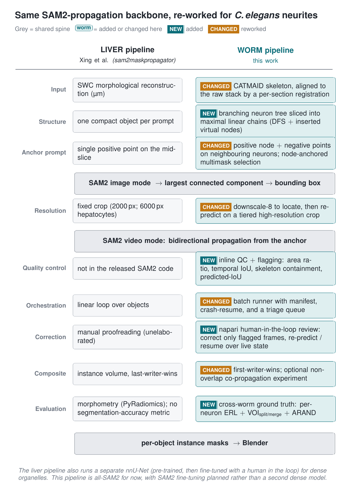
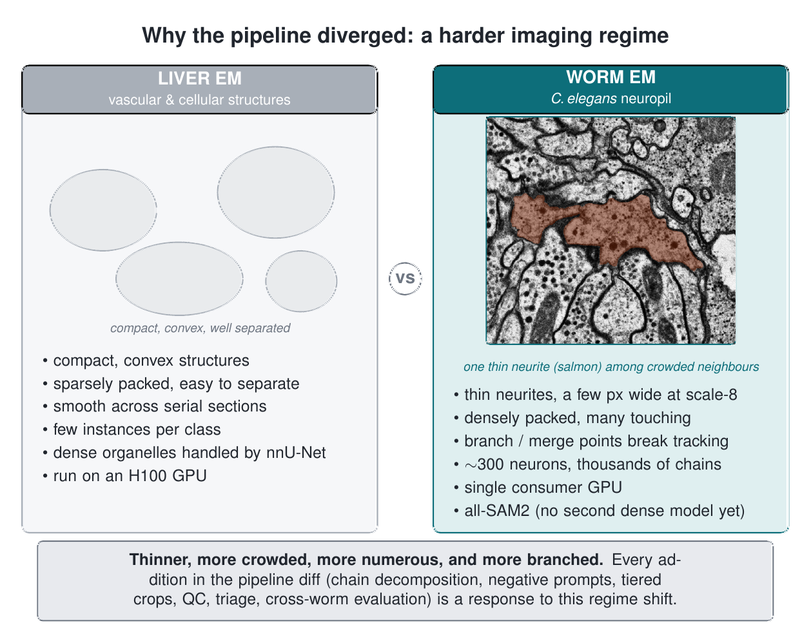
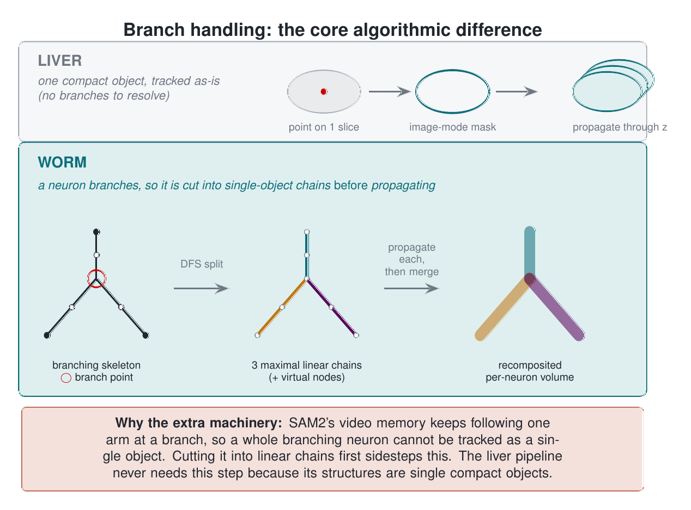
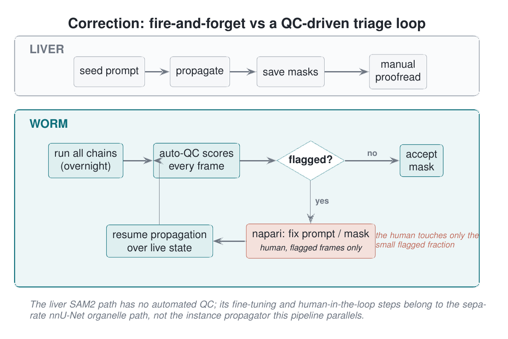

# Worm pipeline vs the liver EM pipeline: figures

Four figures for explaining this pipeline to the author of the liver vEM pipeline (Xing et al.,
`sam2maskpropagator`). They hold the shared SAM2-propagation backbone constant and show what changed
for *C. elegans* neurites and why.

Each figure is a standalone TikZ source that compiles against `common.tex` (shared palette and
badges). Rendered PNG and PDF sit next to each source. To rebuild one:

```bash
pdflatex fig-a-pipeline-diff.tex        # needs common.tex (and em1.png for figure B) alongside
pdftoppm -png -r 200 fig-a-pipeline-diff.pdf fig-a-pipeline-diff
```

## A. Pipeline diff

The main figure. Two aligned columns on a shared grey spine, one row per pipeline stage. Grey rows
are the parts both pipelines share unchanged; the worm column marks each divergence as `NEW` (a stage
the liver pipeline does not have) or `CHANGED` (a shared stage reworked). Read this one first: it is
the direct answer to "what did you do differently."

Source: [fig-a-pipeline-diff.tex](fig-a-pipeline-diff.tex)



## B. Why it diverged

The motivation behind every addition in figure A: the imaging regime is harder. Liver structures are
compact, convex, sparse, and few; worm neurites are thin, densely packed, numerous, and branched, on
a single GPU rather than an H100. The worm panel uses a real EM crop (one neurite in salmon among its
crowded neighbours) to make "thin and crowded" concrete.

Source: [fig-b-why-diverged.tex](fig-b-why-diverged.tex)



## C. Branch handling

The largest algorithmic difference, on its own. A liver structure is one compact object, so one point
drives one propagation. A worm neuron branches, and SAM2's video memory follows only one arm through
a branch, so the neuron is cut into maximal linear chains first, each chain is seeded and propagated
on its own, and the chains are recomposited into the per-neuron volume.

Source: [fig-c-branch-handling.tex](fig-c-branch-handling.tex)



## D. Triage loop

The correction model. The liver SAM2 path is linear and proofread by hand, with no automated QC (its
fine-tuning and human-in-the-loop steps are on the separate nnU-Net organelle path). The worm pipeline
runs every chain headless, scores every frame with automatic QC, and sends only the flagged frames to
a napari tool where a person fixes the prompt or mask and resumes propagation over the live state.

Source: [fig-d-triage-loop.tex](fig-d-triage-loop.tex)


